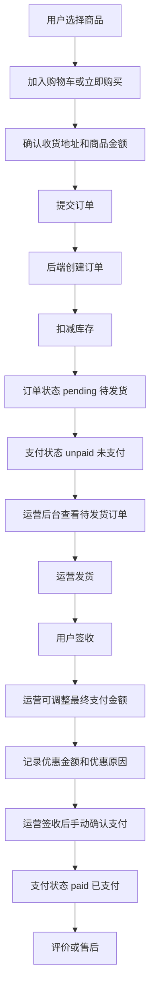

# 悠兰儿童商城基于现有基础的完整开发文档

生成日期：2026-06-02

项目路径：`D:\youlan_kids_shop_self`

依据文档：

- `整体.md`
- `Member_Shop/Wait_Complete.md`
- `Member_Shop_API_DOC.md`
- `聚水潭ERP三大业务流程开发文档.md`
- 当前小程序、Web 管理端、Go 后端代码结构

## 1. 文档目标

本文档用于指导后续完整开发，不是从零重做项目，而是在现有三端基础上补齐上线闭环和待开发功能。

本次开发必须覆盖：

- 小程序用户端
- Web 运营管理端
- Go 后端服务
- 订单特殊业务流程
- 库存体系
- 售后体系
- 评价体系
- 数据分析体系
- 环境、构建、安全、测试、部署基础

其中订单流程按当前业务特殊规则实现：

1. 用户下单不需要在线支付。
2. 用户下单完成后，订单直接进入待处理状态。
3. 最终由运营人员在后台手动确认支付。
4. 运营可以修改最终支付金额。
5. 系统必须保留优惠金额和优惠原因。

## 2. 当前项目基础

### 2.1 三端结构

| 模块 | 目录 | 技术栈 | 当前基础 |
| --- | --- | --- | --- |
| 小程序 | `wx_ui_kids` | 微信原生小程序 | 已有首页、分类、商品详情、搜索、购物车、下单、订单、地址、售后、消息、活动页面 |
| Web 管理端 | `Management_web_shop` | Vue 3、Vite、TypeScript、Element Plus、ECharts | 已有登录、数据总览、首页管理、商品、订单、会员、售后、报表、活动页面 |
| 后端 | `Member_Shop` | Go、Gin、GORM、MySQL、Redis | 已有商品、库存、订单、购物车、地址、售后、评价、活动、消息、数据分析接口 |

### 2.2 当前后端已有能力

| 业务 | 当前情况 | 后续处理 |
| --- | --- | --- |
| 商品 | 已有商品查询、款号、标签、分类、上下架、图片 | 继续完善后台编辑、前台展示和库存联动 |
| 购物车 | 已有添加、查询、改数量、批量删除、清空 | 补齐小程序体验和库存校验 |
| 订单 | 已有创建、查询、取消、发货、收货、子订单、支付接口 | 按特殊订单流程重构支付和金额字段 |
| 库存 | 已有库存查询、调整、日志、预警、下单扣减、取消回滚 | 补聚水潭同步、多仓、盘点、预警页面 |
| 售后 | 已有售后创建、审核、寄回、收货、取消、库存回滚 | 补 Web 操作闭环、小程序展示、售后统计 |
| 评价 | 已有创建、查询、后台审核、回复、统计 | 补小程序评价入口、Web 评价管理页面 |
| 活动 | 已有活动图、宣传图、上下线、排序、详情 | 补小程序活动落地页和后台维护体验 |
| 数据分析 | 已有销售、用户、商品、导出，流量分析预留 | 重新按最终支付金额调整统计口径 |
| 运营用户 | 已有运营/客服用户注册、验证码、改密、状态校验 | 补 Web 登录鉴权和权限控制 |

### 2.3 当前主要风险

| 优先级 | 风险 | 处理方式 |
| --- | --- | --- |
| P0 | Web 当前构建失败 | 修复 `vue-tsc` 与 TypeScript 版本兼容，补 `tsconfig` |
| P0 | 敏感配置硬编码 | DB、Redis、JWT、微信、短信、聚水潭配置全部改环境变量 |
| P0 | 订单支付流程和业务不一致 | 改为“用户下单后直接待发货，签收后运营确认支付” |
| P0 | 订单金额字段不足 | 增加最终支付金额、优惠金额、优惠原因、支付操作人 |
| P1 | 中文编码显示问题 | 统一 UTF-8，修复文案乱码 |
| P1 | 核心测试薄弱 | 补订单、库存、售后、评价、数据分析测试 |
| P1 | 接口返回结构不统一 | 统一响应格式和错误码 |
| P2 | 日志、部署、迁移策略不足 | 补部署文档、日志路径、数据库迁移和回滚方案 |

## 3. 总体开发原则

### 3.1 不推翻现有项目

本次开发应复用现有目录、模型、接口和页面，避免重做：

- 后端继续使用 `controllers`、`routes`、`service/method`、`models`、`requestbody` 分层。
- Web 继续使用 Vue 3 + Element Plus。
- 小程序继续使用原生小程序结构。
- 已有接口保留，必要时兼容旧字段，新增字段以扩展方式加入。

### 3.2 先补交易闭环，再扩运营能力

开发顺序必须是：

1. 构建、配置、安全基础。
2. 订单特殊流程。
3. 库存闭环。
4. 售后闭环。
5. 评价闭环。
6. 数据分析和报表。
7. 运营体验优化。
8. 测试和上线。

### 3.3 金额统计统一口径

后续凡是“销售额”“会员累计消费”“报表销售金额”，都以 `final_pay_amount` 为准，而不是 `order_amount`。

字段含义：

| 字段 | 含义 |
| --- | --- |
| `order_amount` | 下单时原始商品金额 |
| `final_pay_amount` | 运营确认后的最终支付金额 |
| `discount_amount` | 优惠金额，等于 `order_amount - final_pay_amount` |
| `discount_reason` | 优惠原因 |

## 4. 订单特殊流程开发方案

### 4.1 目标流程

订单流程改为：



### 4.2 订单状态

主订单状态 `status`：

| 状态 | 中文 | 触发场景 |
| --- | --- | --- |
| `pending` | 待发货 | 用户提交订单后默认状态，等待运营发货 |
| `shipped` | 已发货 | 运营填写物流并发货 |
| `delivered` | 已完成 | 用户确认收货或物流确认签收 |
| `processing` | 售后中 | 售后审核通过后进入 |
| `canceled` | 已取消 | 用户或运营取消 |

支付状态 `pay_status`：

| 状态 | 中文 | 触发场景 |
| --- | --- | --- |
| `unpaid` | 未支付 | 用户下单后的默认状态 |
| `paid` | 已支付 | 订单签收后由运营后台手动确认支付 |
| `partial_paid` | 部分支付 | 预留状态，当前可不开放 |

小程序展示规则：

| 后端状态 | 小程序展示 |
| --- | --- |
| `status=pending` 且 `pay_status=unpaid` | 待发货 |
| `status=pending` 且 `pay_status=paid` | 异常状态，当前流程不应出现 |
| `status=shipped` | 待收货 |
| `status=delivered` | 已完成 |
| `status=processing` | 售后中 |
| `status=canceled` | 已取消 |

Web 展示规则：

| 后端状态 | Web 展示 |
| --- | --- |
| `pending + unpaid` | 待发货/未支付 |
| `pending + paid` | 异常状态，当前流程不应出现 |
| `shipped + unpaid` | 已发货/未支付 |
| `delivered + unpaid` | 已签收/待确认支付 |
| `delivered + paid` | 已完成 |
| `processing` | 售后中 |
| `canceled` | 已取消 |

### 4.3 数据库字段改造

在 `Member_Shop/models/order.go` 的 `Order` 模型增加字段：

| 字段 | 类型建议 | 说明 |
| --- | --- | --- |
| `FinalPayAmount` | `decimal(10,2)` | 最终支付金额 |
| `DiscountAmount` | `decimal(10,2)` | 优惠金额 |
| `DiscountReason` | `text` | 优惠原因 |
| `PaymentOperatorID` | `int` | 确认支付的运营人员 |
| `PaymentRemark` | `text` | 支付备注 |
| `PriceAdjustedBy` | `int` | 调整金额的运营人员 |
| `PriceAdjustedAt` | `datetime` | 调整金额时间 |

建议 GORM 字段：

```go
FinalPayAmount   float64   `gorm:"column:final_pay_amount;type:decimal(10,2);not null;default:0" json:"final_pay_amount"`
DiscountAmount   float64   `gorm:"column:discount_amount;type:decimal(10,2);not null;default:0" json:"discount_amount"`
DiscountReason   string    `gorm:"column:discount_reason;type:text;null" json:"discount_reason"`
PaymentOperatorID int      `gorm:"column:payment_operator_id;default:0" json:"payment_operator_id"`
PaymentRemark    string    `gorm:"column:payment_remark;type:text;null" json:"payment_remark"`
PriceAdjustedBy  int       `gorm:"column:price_adjusted_by;default:0" json:"price_adjusted_by"`
PriceAdjustedAt  time.Time `gorm:"column:price_adjusted_at;null" json:"price_adjusted_at"`
```

子订单 `SubOrder` 可先不增加优惠字段，默认子订单金额仍使用 `sub_amount`。如果后续要按子订单拆优惠，再增加 `final_sub_amount` 和 `discount_amount`。

### 4.4 创建订单接口

保留现有接口：

`POST /order/add_order`

用户端请求仍由小程序发起，不增加支付参数。创建订单前必须校验 `user_id` 已绑定 active 会员，未登录或非会员用户不得下单。

请求示例：

```json
{
  "user_id": 10001,
  "receiver_name": "张三",
  "receiver_phone": "13800000000",
  "province": "浙江省",
  "city": "杭州市",
  "county": "西湖区",
  "detailed_address": "文一路1号",
  "order_amount": 299.00,
  "product_list": [
    {
      "commodity_id": "SKU001",
      "product_name": "儿童连衣裙",
      "price": 299.00,
      "qty": 1,
      "color": "粉色",
      "size": "120"
    }
  ],
  "remark": "用户备注"
}
```

后端处理步骤：

1. `controllers/order_controller.go` 的 `OrderCreate` 接收请求。
2. 校验收货人、手机号、地址、商品列表。
3. 调用 `service/method/user_method.go` 的 `EnsureActiveMemberUser`，确认 `user_id` 对应 `member_info` active 会员。
4. 调用 `service/method/order_method.go` 的 `CreateOrder`。
5. `CreateOrder` 生成订单号。
6. 序列化商品列表。
6. 计算商品名称列表。
7. 校验库存。
8. 开启数据库事务。
9. 写入 `order_data`。
10. 写入 `sub_order_data`。
11. 扣减库存。
12. 写库存日志。
13. 设置订单字段：
    - `status = pending`
    - `pay_status = unpaid`
    - `final_pay_amount = order_amount`
    - `discount_amount = 0`
    - `discount_reason = ""`
14. 提交事务。
15. 返回订单号和订单状态。

返回示例：

```json
{
  "code": 200,
  "msg": "success",
  "data": {
    "order_id": "Y202606020001",
    "status": "pending",
    "pay_status": "unpaid",
    "order_amount": 299.00,
    "final_pay_amount": 299.00,
    "discount_amount": 0
  }
}
```

### 4.5 运营调整订单金额接口

新增接口：

`POST /order/update_payment_amount`

请求体：

```json
{
  "order_id": "Y202606020001",
  "final_pay_amount": 269.00,
  "discount_reason": "老客户优惠",
  "operator_id": 1
}
```

请求结构新增到 `Member_Shop/requestbody/order_requestbody.go`：

```go
type UpdatePaymentAmountRequest struct {
    OrderID        string  `json:"order_id" binding:"required"`
    FinalPayAmount float64 `json:"final_pay_amount" binding:"required,min=0"`
    DiscountReason string  `json:"discount_reason"`
    OperatorID     int     `json:"operator_id" binding:"required"`
}
```

后端处理步骤：

1. 查询订单是否存在。
2. 校验订单未取消。
3. 校验订单未支付：`pay_status = unpaid`。
4. 校验最终支付金额不能小于 0。
5. 校验最终支付金额不能大于原订单金额。
6. 计算优惠金额：`discount_amount = order_amount - final_pay_amount`。
7. 如果 `discount_amount > 0`，`discount_reason` 必填。
8. 保存最终支付金额、优惠金额、优惠原因、调整人、调整时间。
9. 返回最新金额。

返回示例：

```json
{
  "code": 200,
  "msg": "success",
  "data": {
    "order_id": "Y202606020001",
    "order_amount": 299.00,
    "final_pay_amount": 269.00,
    "discount_amount": 30.00,
    "discount_reason": "老客户优惠"
  }
}
```

### 4.6 运营签收后手动确认支付接口

新增接口并兼容现有支付入口：

`POST /order/confirm_payment`

旧 `POST /order/pay` 可继续保留为兼容入口，但实际逻辑统一走签收后确认支付。

请求体：

```json
{
  "order_id": "Y202606020001",
  "operator_id": 1,
  "payment_method": "manual",
  "payment_remark": "运营确认客户已线下支付"
}
```

新增请求结构：

```go
type ManualPayOrderRequest struct {
    OrderID       string `json:"order_id" binding:"required"`
    OperatorID    int    `json:"operator_id" binding:"required"`
    PaymentMethod string `json:"payment_method" binding:"required"`
    PaymentRemark string `json:"payment_remark"`
}
```

后端处理步骤：

1. 查询订单。
2. 校验订单存在。
3. 校验订单未取消。
4. 校验订单状态必须为 `delivered`。
5. 校验 `pay_status != paid`。
6. 校验 `final_pay_amount >= 0`。
7. 更新主订单：
   - `pay_status = paid`
   - `payment_method = manual`
   - `payment_time = now`
   - `payment_operator_id = operator_id`
   - `payment_remark = payment_remark`
8. 同步子订单：`pay_status = paid`。
9. 更新会员累计支付金额，使用 `final_pay_amount`。
10. 返回支付结果。

返回示例：

```json
{
  "code": 200,
  "msg": "success",
  "data": {
    "order_id": "Y202606020001",
    "status": "pending",
    "pay_status": "paid",
    "order_amount": 299.00,
    "final_pay_amount": 269.00,
    "discount_amount": 30.00,
    "payment_method": "manual",
    "payment_time": "2026-06-02 15:30:00"
  }
}
```

### 4.7 发货接口改造

保留接口：

`POST /order/deliver`

请求体：

```json
{
  "order_id": "Y202606020001",
  "user_id": 10001,
  "express_company": "顺丰",
  "express_number": "SF123456789"
}
```

后端校验：

1. 订单必须存在。
2. 订单状态必须为 `pending`。
3. 发货不依赖支付状态，订单只要处于 `pending` 即可发货。
4. 订单不能是 `canceled`。
5. 物流公司必填。
6. 物流单号必填。

通过后更新：

- `status = shipped`
- `express_company`
- `express_number`
- `shipped_time`

### 4.8 订单取消

保留接口：

`POST /order/cancel`

取消规则：

| 场景 | 是否允许取消 | 库存处理 |
| --- | --- | --- |
| `pending + unpaid` | 允许 | 回滚库存 |
| `pending + paid` | 允许，但需运营确认退款或反向处理 | 回滚库存 |
| `shipped` | 不建议直接取消 | 走售后 |
| `delivered` | 不允许直接取消 | 走售后 |
| `processing` | 不允许取消 | 走售后 |

## 5. 库存体系开发方案

### 5.1 目标

根据 `Wait_Complete.md`，库存体系需要实现：

- 实时库存监控和更新
- 库存预警
- 库存日志
- 多仓库存管理
- 库存调拨
- 库存盘点

现有后端已有库存相关接口和库存日志基础，应在现有基础上扩展。

### 5.2 下单扣库存

业务规则：

用户提交订单时直接扣库存，不等支付。

原因：

- 用户侧没有支付动作。
- 下单即进入待处理。
- 防止同一 SKU 被多人同时下单造成超卖。

后端步骤：

1. 解析订单商品列表。
2. 按 SKU 和数量校验库存。
3. 使用数据库事务。
4. 使用行级锁锁定 SKU 库存。
5. 扣减库存。
6. 创建订单。
7. 创建子订单。
8. 写库存日志。

库存日志类型：

| 类型 | 说明 |
| --- | --- |
| `order_create_deduct` | 下单扣减库存 |
| `order_cancel_restore` | 取消订单回滚库存 |
| `return_completed_restore` | 售后完成回滚库存 |
| `manual_adjust` | 后台手动调整 |
| `jushuitan_sync` | 聚水潭同步 |
| `stock_transfer` | 仓库调拨 |
| `stock_check` | 盘点修正 |

### 5.3 库存预警

后端接口：

`POST /inventory/warnings`

Web 展示：

- SKU
- 商品名称
- 当前库存
- 预警阈值
- 所属仓库
- 最近更新时间

操作：

- 设置预警阈值
- 一键查看低库存商品
- 导出低库存列表

### 5.4 多仓库存

建议新增或扩展库存模型字段：

| 字段 | 说明 |
| --- | --- |
| `warehouse_id` | 仓库 ID |
| `warehouse_name` | 仓库名称 |
| `commodity_id` | SKU |
| `available_stock` | 可用库存 |
| `locked_stock` | 锁定库存 |
| `warning_threshold` | 预警阈值 |

若短期不做多仓，可先保留默认仓：

`warehouse_id = default`

### 5.5 库存调拨

Web 操作：

1. 运营进入库存管理。
2. 选择源仓库。
3. 选择目标仓库。
4. 选择 SKU。
5. 输入调拨数量。
6. 提交。

后端处理：

1. 校验源仓库存足够。
2. 扣减源仓库存。
3. 增加目标仓库存。
4. 写两条库存日志。

### 5.6 库存盘点

Web 操作：

1. 运营导出盘点表。
2. 线下盘点。
3. 回填实际库存。
4. 上传或逐条调整。
5. 系统记录差异。

后端处理：

- 保存盘点批次。
- 保存盘点明细。
- 按差异调整库存。
- 写库存日志。

## 6. 售后体系开发方案

### 6.1 目标

根据 `Wait_Complete.md`，售后体系需要覆盖：

- 退货流程
- 换货流程
- 售后工单
- 售后统计

当前后端已有售后单、退货、寄回、收货、库存回滚基础。本轮将主流程调整为聚水潭 ERP 主导：自有商城创建售后后立即上传聚水潭，ERP 审核/入库通过推送或查询回写商城，商城在最终同意退款时完成售后状态。

### 6.2 售后状态

| 状态 | 中文 | 说明 |
| --- | --- | --- |
| `pending` | 待审核 | 用户提交售后申请 |
| `approved` | 已通过 | 聚水潭 ERP 审核通过，商城订单进入售后中 |
| `rejected` | 已拒绝 | 聚水潭 ERP 拒绝售后 |
| `buyer_shipped` | 买家已寄回 | 用户填写退货物流 |
| `received` | ERP 已入库 | 聚水潭确认退货入库，商城回滚退货库存 |
| `completed` | 已完成 | 商城同意退款/最终完成 |
| `canceled` | 已取消 | 用户或运营取消 |

### 6.3 小程序售后流程

1. 用户进入订单详情。
2. 点击“申请售后”。
3. 选择售后类型：
   - 退货
   - 换货
   - 仅退款
4. 选择原因。
5. 填写具体描述。
6. 选择售后商品。
7. 选择寄回地址或填写买家信息。
8. 提交售后申请。
9. 跳转售后详情。

接口：

`POST /return_order/create`

### 6.4 聚水潭 ERP 售后流程

1. 买家在小程序提交售后申请。
2. 商城创建本地售后单，状态为 `pending`，并调用聚水潭 `/open/aftersale/upload` 上传售后单。
3. 聚水潭 ERP 创建退换补售后单，并在 ERP 内审核退货退款、换货、补发分支。
4. ERP 审核通过回写商城为 `approved`，商城订单/子订单进入售后中。
5. 买家寄回商品；聚水潭退货入库后通过售后推送或 `/open/aftersale/received/query` 补偿查询回写商城为 `received`。
6. 商城收到 `received` 后回滚退货类库存，但不立即结束售后。
7. 商城最终同意退款/确认完成后调用 `/return_order/receive`，售后单进入 `completed`。
8. 若聚水潭拒绝、取消或关闭售后，商城回写 `rejected` 或 `canceled`。

### 6.5 售后统计

统计指标：

| 指标 | 口径 |
| --- | --- |
| 售后申请数 | 售后单总数 |
| 待处理售后数 | `status = pending` |
| 售后完成数 | `status = completed` |
| 售后率 | 售后订单数 / 已完成订单数 |
| 售后金额 | 售后商品金额或退款金额 |
| 售后原因排行 | 按 reason 聚合 |

## 7. 评价体系开发方案

### 7.1 目标

根据 `Wait_Complete.md`，评价体系需要覆盖：

- 商品评价
- 评价管理
- 评价统计
- 评价回复
- 评价标签

当前后端已有评价模型和接口基础，后续重点补小程序入口和 Web 管理页面。

### 7.2 小程序评价流程

1. 用户订单完成后进入订单详情。
2. 点击“评价”。
3. 按商品填写评分。
4. 填写评价内容。
5. 上传评价图片。
6. 提交评价。
7. 后端创建评价，状态为 `pending`。
8. 后台审核通过后前台展示。

### 7.3 Web 评价管理

页面功能：

- 评价列表
- 按商品、用户、状态、时间筛选
- 查看评价详情
- 审核通过
- 拒绝
- 隐藏
- 商家回复

评价状态：

| 状态 | 中文 |
| --- | --- |
| `pending` | 待审核 |
| `approved` | 已通过 |
| `rejected` | 已拒绝 |
| `hidden` | 已隐藏 |

### 7.4 商品详情评价展示

小程序商品详情展示：

- 平均评分
- 评价数量
- 评价标签
- 最新评价列表
- 有图评价筛选

只展示 `approved` 状态评价。

## 8. 数据分析体系开发方案

### 8.1 目标

根据 `Wait_Complete.md`，数据分析体系需要覆盖：

- 销售统计
- 用户分析
- 商品分析
- 流量分析
- 数据报表和导出

当前后端已有 `analytics` 接口基础，需修正统计口径并补 Web 展示。

### 8.2 销售统计口径

订单特殊流程下，销售额必须按运营确认支付后的金额统计。

| 指标 | 口径 |
| --- | --- |
| 订单数 | 全部订单数 |
| 待处理订单数 | `status = pending` |
| 已支付订单数 | `pay_status = paid` |
| 销售额 | `SUM(final_pay_amount)` 且 `pay_status = paid` |
| 原订单金额 | `SUM(order_amount)` |
| 优惠金额 | `SUM(discount_amount)` |
| 客单价 | 销售额 / 已支付订单数 |

### 8.3 用户分析

指标：

- 新增用户数
- 下单用户数
- 已支付用户数
- 用户累计消费金额
- 会员来源
- 复购率

会员累计消费金额必须使用 `final_pay_amount`。

### 8.4 商品分析

指标：

- 商品销量
- 商品销售额
- 热销商品
- 滞销商品
- 低库存商品
- 售后率高商品

### 8.5 流量分析

当前流量分析为预留功能。

开发步骤：

1. 小程序埋点：
   - 首页访问
   - 商品详情访问
   - 搜索
   - 加入购物车
   - 提交订单
2. 后端新增埋点接收接口。
3. 记录用户 ID、页面、事件、时间、商品 ID。
4. Web 报表展示访问量、转化率。

## 9. Web 管理端开发方案

### 9.1 基础修复

第一步必须修复 Web 构建。

当前问题：

- `vue-tsc@1.8.27` 与 `typescript@5.9.3` 不兼容。
- 项目缺少标准 `tsconfig*.json`。

处理：

1. 固定 TypeScript 到兼容版本，或升级 `vue-tsc`。
2. 补 `tsconfig.json`。
3. 补 `src/env.d.ts`。
4. 执行 `npm run build`。
5. 确保构建产物正常生成。

### 9.2 登录鉴权

后续 Web 必须实现：

- 登录页调用真实后端接口。
- 保存 access_token。
- 请求自动带 token。
- 未登录自动跳转登录页。
- token 失效自动重新获取或退出。
- 退出登录清理 token。

### 9.3 订单管理页面

订单列表增加：

- 订单号
- 用户
- 原订单金额
- 最终支付金额
- 优惠金额
- 支付状态
- 订单状态
- 下单时间

操作按钮：

| 条件 | 按钮 |
| --- | --- |
| `pending + unpaid` | 调整金额、发货、取消订单 |
| `shipped + unpaid` | 调整金额、等待签收 |
| `shipped` | 查看物流 |
| `delivered + unpaid` | 调整金额、确认支付、售后 |
| `delivered + paid` | 查看详情、查看评价、售后 |
| `processing` | 查看售后 |

### 9.4 订单详情页面

订单详情必须展示：

- 收货信息
- 商品列表
- 原订单金额
- 最终支付金额
- 优惠金额
- 优惠原因
- 支付状态
- 支付方式
- 支付时间
- 支付备注
- 订单状态
- 物流信息
- 售后信息

### 9.5 调整金额弹窗

字段：

- 原订单金额，只读
- 最终支付金额，必填
- 优惠金额，自动计算
- 优惠原因，有优惠时必填

保存调用：

`POST /order/update_payment_amount`

### 9.6 确认支付弹窗

字段：

- 最终支付金额，只读
- 支付方式
- 支付备注

保存调用：

`POST /order/pay`

### 9.7 商品管理

需要补齐：

- 商品列表筛选
- 商品上下架
- 款号详情
- SKU 颜色尺码库存展示
- 商品图片上传
- 标签编辑
- 活动关联

### 9.8 库存管理

新增或完善页面：

- 库存列表
- 库存日志
- 库存预警
- 手动调整
- 多仓调拨
- 盘点

### 9.9 售后中心

需要从当前 mock/占位状态改为真实接口：

- 售后列表
- 售后详情
- 审核通过
- 审核拒绝
- 确认收货
- 售后完成
- 售后统计

### 9.10 评价管理

新增页面：

- 评价列表
- 评价详情
- 审核
- 回复
- 隐藏
- 评价统计

### 9.11 数据报表

完善：

- 销售总览
- 用户分析
- 商品分析
- 库存预警
- 售后统计
- 导出功能

## 10. 小程序开发方案

### 10.1 请求层整理

当前 `api/request.js` 默认生产域名硬编码。

需要改为：

- 开发环境
- 测试环境
- 生产环境

并统一：

- access_token 获取
- token 失效处理
- 请求失败提示
- loading 行为

### 10.1.1 微信会员登录授权

小程序登录必须走会员手机号授权：

1. 登录页第一步只展示手机号授权登录。
2. 手机号授权按钮使用 `button open-type="getPhoneNumber"`，一次点击获取 `detail.code`。
3. 点击手机号授权后调用 `wx.login` 获取临时登录 `code`。
4. 小程序调用 `POST /ordinary_user/wechat_login`，请求体包含 `code`、`phone_code`。
5. 后端使用 `jscode2session` 换 openid，使用稳定 access_token 加 `getuserphonenumber` 换手机号。
6. 手机号必须已存在于 `member_info` 且状态不是 `disabled`；非会员手机号返回 `403`，不能生成登录 token。
7. 首次登录成功后，`member_info.mobile`、`member_info.user_id`、`member_info.openid` 和 `users_user.mobile` 固定绑定；一个手机号只允许对应一个 `user_id`。
8. 手机号登录成功后，小程序显示头像昵称补全区。
9. 头像按微信新版能力使用 `button open-type="chooseAvatar"` 获取临时头像路径；昵称使用 `input type="nickname"` 获取微信昵称建议。
10. 头像和昵称不是同一个微信授权能力，不能与手机号授权合并成一个弹窗；页面提供“保存并进入”和“暂不完善，直接进入”。
11. 头像若是 `wxfile://` 临时路径，登录成功后小程序再上传到 `Modify_data`，避免后端保存不可访问的临时路径。

相关微信官方文档：

- `wx.login`：https://developers.weixin.qq.com/miniprogram/dev/api/open-api/login/wx.login.html
- 手机号授权：https://developers.weixin.qq.com/miniprogram/dev/framework/open-ability/getPhoneNumber.html
- 手机号服务端换取：https://developers.weixin.qq.com/miniprogram/dev/OpenApiDoc/user-info/phone-number/getPhoneNumber.html
- 头像昵称填写能力：https://developers.weixin.qq.com/miniprogram/dev/framework/open-ability/userProfile.html
- `button` 组件 open-type：https://developers.weixin.qq.com/miniprogram/dev/component/button.html
- `input type="nickname"`：https://developers.weixin.qq.com/miniprogram/dev/component/input.html

### 10.2 首页

完善：

- 活动图展示
- 宣传图展示
- 商品推荐
- 分类入口
- 搜索入口

接口：

- `/activity/query_online_activity_images`
- `/commodity/goods_query_wx`

### 10.3 商品列表和详情

商品列表：

- 分类筛选
- 标签筛选
- 搜索
- 分页加载
- 只展示上线商品

商品详情：

- 商品主图
- 颜色
- 尺码
- 库存
- 价格
- 评价
- 加入购物车
- 立即购买

### 10.4 购物车

完善：

- 商品数量加减
- 删除商品
- 全选
- 合计金额
- 库存不足提示
- 失效商品提示

### 10.5 下单确认

下单确认页只做提交订单，不进入支付。

展示：

- 收货地址
- 商品列表
- 原订单金额
- 优惠金额
- 最终金额
- 用户备注

提交成功后：

- 跳转订单详情
- 显示“订单已提交，请等待商家处理”

### 10.6 订单列表

订单状态标签按组合状态展示：

- 待处理
- 待发货
- 待收货
- 已完成
- 售后中
- 已取消

### 10.7 订单详情

展示：

- 订单状态
- 支付状态
- 收货信息
- 商品信息
- 金额信息
- 物流信息
- 售后入口
- 评价入口

未支付时展示：

“订单已提交，请等待商家处理”

不要展示在线支付按钮。

### 10.8 售后

完善：

- 申请售后
- 售后详情
- 填写寄回物流
- 查看处理状态

### 10.9 评价

新增或完善：

- 已完成订单评价入口
- 商品评价提交
- 商品详情评价展示

## 11. 后端接口开发清单

### 11.1 订单接口

| 接口 | 动作 | 状态 |
| --- | --- | --- |
| `POST /order/add_order` | 用户提交订单 | 改造 |
| `POST /order/update_payment_amount` | 运营调整最终金额 | 新增 |
| `POST /order/pay` | 运营确认支付 | 改造 |
| `POST /order/deliver` | 运营发货 | 改造 |
| `POST /order/cancel` | 取消订单 | 完善 |
| `POST /order/order_receive` | 用户确认收货 | 保留 |
| `POST /order/query_order_data` | 订单详情 | 增加金额字段 |
| `POST /order/orders_query` | 订单列表 | 增加支付状态筛选 |

### 11.2 库存接口

| 接口 | 动作 |
| --- | --- |
| `POST /inventory/query` | 查询库存 |
| `POST /inventory/adjust` | 手动调整库存 |
| `POST /inventory/logs` | 查询库存日志 |
| `POST /inventory/warnings` | 查询库存预警 |
| `POST /inventory/transfer` | 多仓调拨，新增 |
| `POST /inventory/stock_check/create` | 创建盘点，新增 |
| `POST /inventory/stock_check/confirm` | 确认盘点，新增 |
| `POST /inventory/sync_jushuitan` | 聚水潭同步，完善 |

### 11.3 售后接口

| 接口 | 动作 |
| --- | --- |
| `POST /return_order/create` | 创建售后 |
| `POST /return_order/query` | 售后列表 |
| `POST /return_order/detail` | 售后详情 |
| `POST /return_order/approve` | 审核售后 |
| `POST /return_order/deliver` | 买家寄回 |
| `POST /return_order/receive` | 商城同意退款/完成售后 |
| `POST /return_order/cancel` | 取消售后 |
| `POST /return_order/push_jushuitan` | 售后上传失败后重推聚水潭 |
| `POST /return_order/jushuitan_after_sale_push` | 聚水潭售后状态推送回写 |
| `POST /return_order/jushuitan_after_sale_received_query` | 聚水潭实际收货查询补偿 |

### 11.4 评价接口

| 接口 | 动作 |
| --- | --- |
| `POST /review/create` | 创建评价 |
| `POST /review/query_by_product` | 商品评价 |
| `POST /review/query_backend` | 后台评价列表 |
| `POST /review/audit` | 审核评价 |
| `POST /review/reply` | 回复评价 |
| `POST /review/statistics` | 评价统计 |

### 11.5 数据分析接口

| 接口 | 动作 |
| --- | --- |
| `POST /analytics/sales_summary` | 销售统计 |
| `POST /analytics/user_summary` | 用户分析 |
| `POST /analytics/product_summary` | 商品分析 |
| `POST /analytics/traffic_summary` | 流量分析 |
| `POST /analytics/export` | 导出 |

## 12. 开发任务和人天

| 序号 | 模块 | 任务 | 说明 | 人天 |
| --- | --- | --- | --- | ---: |
| 1 | 全局 | 编码和文档整理 | 修复中文乱码、统一 UTF-8、更新开发文档 | 1 |
| 2 | 全局 | 环境配置治理 | 小程序/Web/后端环境变量和域名切换 | 2 |
| 3 | 全局 | 敏感配置治理 | DB、Redis、JWT、微信、短信、聚水潭配置清理 | 2 |
| 4 | Web | 构建修复 | 修复 `vue-tsc`、TypeScript、`tsconfig` | 1.5 |
| 5 | Web | 登录鉴权 | 登录、token、路由守卫、退出 | 2 |
| 6 | 后端 | 订单金额字段 | 增加最终金额、优惠金额、优惠原因等字段 | 1 |
| 7 | 后端 | 创建订单改造 | 下单不支付，直接待处理，扣库存 | 2 |
| 8 | 后端 | 调整金额接口 | 运营调整最终金额和优惠原因 | 1.5 |
| 9 | 后端 | 手动支付接口 | 运营确认支付，更新会员累计消费 | 2 |
| 10 | 后端 | 发货校验 | 下单后待发货即可发货，付款不是发货依据 | 1 |
| 11 | 小程序 | 下单流程改造 | 去掉支付按钮，提交后待处理 | 2 |
| 12 | 小程序 | 订单展示改造 | 展示支付状态、优惠、最终金额 | 1.5 |
| 13 | Web | 订单列表改造 | 支付状态、金额、操作按钮 | 2 |
| 14 | Web | 订单详情改造 | 调整金额、确认支付、发货 | 3 |
| 15 | 后端 | 库存预警完善 | 查询、阈值、低库存列表 | 2 |
| 16 | 后端 | 多仓调拨 | 仓库模型、调拨接口、日志 | 4 |
| 17 | 后端 | 库存盘点 | 盘点批次、明细、确认调整 | 4 |
| 18 | Web | 库存管理页面 | 库存列表、日志、预警、调整 | 4 |
| 19 | 小程序 | 商品库存提示 | 商品详情和购物车库存不足提示 | 1.5 |
| 20 | 后端 | 售后接口完善 | 退货、换货、退款、库存回滚 | 3 |
| 21 | Web | 售后中心真实接口 | 列表、审核、收货、完成 | 3 |
| 22 | 小程序 | 售后流程完善 | 申请、详情、物流、状态 | 3 |
| 23 | 后端 | 评价体系完善 | 标签、统计、审核规则 | 2 |
| 24 | Web | 评价管理页面 | 审核、回复、隐藏、统计 | 3 |
| 25 | 小程序 | 评价入口 | 订单评价、商品详情评价展示 | 2 |
| 26 | 后端 | 数据分析口径调整 | 使用 `final_pay_amount` 做销售统计 | 2 |
| 27 | Web | 报表页面完善 | 销售、用户、商品、售后、导出 | 3 |
| 28 | 后端 | 流量分析埋点 | 埋点接口和数据表 | 2 |
| 29 | 小程序 | 流量埋点 | 首页、商品、搜索、购物车、下单 | 2 |
| 30 | 后端 | 接口响应统一 | 统一成功、失败、错误码 | 2 |
| 31 | 后端 | 核心测试 | 订单、库存、售后、评价、统计 | 5 |
| 32 | 前端 | 冒烟测试 | 小程序和 Web 主流程验收 | 3 |
| 33 | 运维 | 部署上线文档 | 启动、日志、迁移、回滚 | 2 |

合计：约 79 人天。

建议 2 名开发并行，排期 7 到 9 周；如果 1 名全栈开发推进，排期约 14 到 16 周。

## 13. 推荐排期

### 第 1 周：基础修复

- 修复 Web 构建。
- 统一编码。
- 抽离环境变量。
- 清理敏感配置。
- 补启动和部署说明。

### 第 2 到 3 周：订单特殊流程

- 后端订单金额字段。
- 创建订单改造。
- 调整金额接口。
- 手动支付接口。
- 发货校验。
- 小程序下单改造。
- Web 订单管理改造。

### 第 4 到 5 周：库存体系

- 下单扣库存稳定化。
- 取消订单回滚。
- 售后回滚。
- 库存预警。
- 库存日志。
- 多仓调拨。
- 库存盘点。
- Web 库存页面。

### 第 6 周：售后体系

- 小程序售后申请。
- Web 售后审核。
- 退货、换货、退款。
- 售后统计。
- 库存回滚验收。

### 第 7 周：评价体系和数据分析

- 小程序评价。
- Web 评价管理。
- 商品详情评价展示。
- 销售、用户、商品报表。
- 统计口径修正。

### 第 8 周：测试和上线准备

- 后端核心测试。
- 小程序主流程测试。
- Web 主流程测试。
- 部署验证。
- 回归修复。

## 14. 验收标准

### 14.1 订单流程验收

- 用户下单不出现支付页面。
- 下单成功后订单为 `pending + unpaid`。
- 下单成功后库存已扣减。
- 运营可以调整最终支付金额。
- 有优惠时必须填写优惠原因。
- 已支付订单不能调整金额。
- 运营确认支付后 `pay_status = paid`。
- 会员累计消费按 `final_pay_amount` 增加。
- 未支付订单可以发货，付款不是发货依据。
- 订单签收后才允许运营确认支付。

### 14.2 库存验收

- 库存不足不能下单。
- 下单扣库存。
- 取消订单回滚库存。
- 售后完成回滚库存。
- 手动调整有日志。
- 预警商品可查询。
- 多仓调拨库存正确。

### 14.3 售后验收

- 用户可以申请退货、换货、退款。
- 运营可以审核售后。
- 审核通过后订单进入售后中。
- 买家寄回后可填写物流。
- 运营确认收货后售后完成。
- 售后完成后库存回滚。

### 14.4 评价验收

- 已完成订单可以评价。
- 评价默认待审核。
- 后台审核通过后商品详情展示。
- 商家可以回复评价。
- 评价统计正确。

### 14.5 数据分析验收

- 销售额按 `final_pay_amount` 统计。
- 优惠金额按 `discount_amount` 统计。
- 已支付订单按 `pay_status = paid` 统计。
- 报表可筛选时间。
- 报表可导出。

## 15. 结论

当前项目已经具备三端业务基础，不需要重做。后续开发应围绕“上线闭环”推进，核心是修正订单业务模型：用户只下单不支付，下单后直接进入待发货；运营后台负责最终金额调整、优惠原因记录，并在订单签收后手动确认支付。

在订单流程稳定后，再依次补齐库存、售后、评价和数据分析体系。所有统计口径必须围绕最终支付金额 `final_pay_amount`，这样才能符合实际运营结算。
## 更新进度记录

| 日期 | 分支 | 提交 | 范围 | 验证 | 推送状态 |
| --- | --- | --- | --- | --- | --- |
| 2026-06-02 | develop | fbf587e | 第二-三周基础修复第一批：后端订单实付金额、优惠原因、运营改价、确认支付接口、支付校验测试 | `go test ./...` 通过 | `origin/master` 已同步；`develop` 已继续推进 |
| 2026-06-02 | develop | wire order payment operations UI | 第二-三周基础修复第二批：Web 订单列表展示实付金额/支付状态，接入运营改价和确认支付操作 | `npm run build` 通过 | `origin/develop` 已推送 |
| 2026-06-02 | develop | d4c35b7 | 纠正订单流程：下单后待发货，发货不依赖付款，签收后才确认支付 | `go test ./...`、`npm run build` 通过 | `origin/develop` 已推送 |
| 2026-06-02 | develop | add order receive operation | 第二-三周基础修复：Web 订单列表补齐已发货订单的确认签收操作，形成发货到签收再付款链路 | `npm run build` 通过 | `origin/develop` 已推送 |
| 2026-06-02 | develop | 80ea05e | 第二-三周基础修复：Web 订单详情展示支付状态、实付金额、优惠信息，并支持签收后确认支付 | `npm run build` 通过 | `origin/develop` 已推送 |
| 2026-06-02 | develop | 7f24b7e | 第二-三周基础修复：Web 订单详情补齐改价、发货、确认签收、签收后确认支付完整操作链路 | `npm run build` 通过 | `origin/develop` 已推送 |
| 2026-06-02 | develop | 38fd549 | 第二-三周基础修复：小程序下单页、订单列表、订单详情按“下单待发货、未支付、收货后线下结算”展示，并接入真实确认签收接口 | `node --check` 通过 | `origin/develop` 已推送 |
| 2026-06-03 | develop | 32f7ebb | 第二-三周基础修复续：数据分析改用最终实付金额；第四-五周基础修复：库存日志类型、调拨、盘点、Web 库存管理页面 | `go test ./...`、`npm run build` 通过 | `origin/develop` 已推送 |
| 2026-06-03 | develop | 448290f | 第六周基础修复第一批：后端售后统计接口、售后率/售后金额/原因排行、仅退款创建校验修复 | `go test ./...` 通过 | `origin/develop` 已推送 |
| 2026-06-03 | develop | 69b567c | 第六周基础修复第二批：Web 售后中心接入真实查询/审核/收货/统计接口；小程序售后申请接入真实创建接口并支持买家填写寄回物流 | `go test ./...`、`npm run build`、`node --check` 通过 | `origin/develop` 已推送 |
| 2026-06-03 | develop | 2a2af6a | 第六周推送状态记录：确认第一批和第二批第六周修复均已同步到远端 | 文档更新 | GitHub 443 连接失败，待重试推送到 `origin/develop` |
| 2026-06-03 | develop | 95ca8c5 | 第七周基础修复第一批：Web 评价管理接入查询/审核/隐藏/回复/统计接口，报表页接入销售/用户/商品/导出真实接口 | `npm run build` 通过 | GitHub 443 连接失败，待重试推送到 `origin/develop` |
| 2026-06-03 | develop | ed1d070 | 第七周基础修复第二批：小程序订单详情新增评价入口，新增评价提交页，商品详情展示审核通过评价和商家回复 | `go test ./...`、`node --check` 通过 | GitHub 443 连接失败，待重试推送到 `origin/develop` |
| 2026-06-03 | develop | f75ce36 | 第七周更新记录：新增第七周基础修复更新记录并同步总日志 | 文档更新 | GitHub 443 连接失败，待重试推送到 `origin/develop` |
| 2026-06-03 | develop | e43f6b4 | Redis 缓存与后台登录流程：活动图 Redis 缓存、后台手机号邀请/验证码激活/密码登录/JWT 校验、账号状态和权限菜单管理 | `go test ./...`、`npm run build` 通过 | `origin/develop` 已推送 |
| 2026-06-04 | develop | 65e21ea | 后台用户管理优化：修复注册后未激活问题，权限改为页面访问列表，身份固定为运营/客服/管理员，Web 账号管理支持勾选页面权限 | `go test ./...`、`npm run build` 通过 | `origin/develop` 已推送 |
| 2026-06-04 | develop | 7b40c3e | 售后流程调整为聚水潭 ERP 主导：创建售后后上传 `/open/aftersale/upload`，新增售后推送回写、实际收货查询补偿、ERP 入库后库存回滚、商城最终退款完成 | `go test ./...` 通过 | `origin/develop` 已推送 |
| 2026-06-04 | develop | 待提交 | 基于三张流程图梳理订单发货、售后、库存三条聚水潭 ERP 联动开发文档，明确当前实现、缺口、接口契约和后续任务 | 文档更新 | 待推送 |
