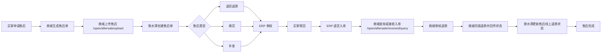
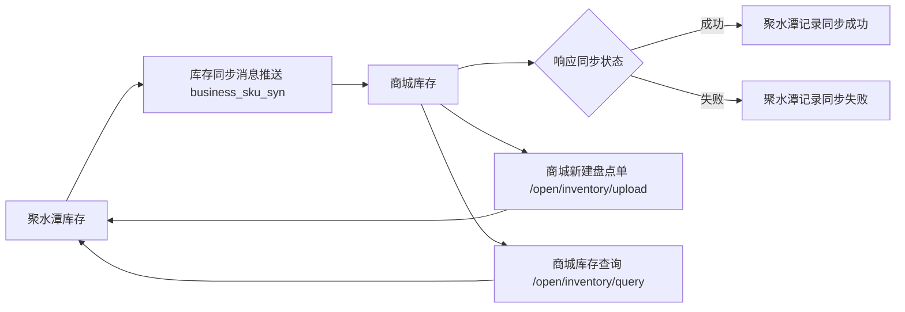

# 聚水潭 ERP 三大业务流程开发文档

生成日期：2026-06-04

项目路径：`D:\youlan_kids_shop_self`

依据：

- 用户提供的三张流程图：订单发货业务流程、售后流程、库存同步流程
- 当前 Go 后端：`Member_Shop`
- 当前管理端：`Management_web_shop`
- 当前小程序端：`wx_ui_kids`
- 已有文档：`基于现有基础开发文档.md`、`Member_Shop_API_DOC.md`

## 1. 文档目标

本文档用于把当前商城和聚水潭 ERP 的订单发货、售后、库存三条业务链路统一成可开发、可验收、可持续推送的开发方案。

本次不是从零重做系统，而是在当前三端和后端接口基础上补齐 ERP 联动闭环：

- 订单发货：商城下单后上传聚水潭，ERP 完成审单、打单、拣货、发货，商城接收发货结果并更新订单物流。
- 售后：商城创建售后后上传聚水潭，ERP 审核退货退款、换货、补发，商城接收售后状态和实际收货结果。
- 库存：ERP 库存变化主动同步商城，商城支持盘点上传和库存查询，最终以 ERP 库存为主、商城库存为可售展示和本地扣减缓存。

## 2. 当前实现结论

| 业务链路 | 当前状态 | 已有能力 | 主要缺口 |
| --- | --- | --- | --- |
| 订单发货 | 部分完成 | `/order/add_order` 创建订单并上传聚水潭；`/order/jushuitan_ship_info` 接收聚水潭发货推送；本地有发货、签收、确认支付 | 缺少物流同步 `/open/logistic/upload`、物流查询 `/open/logistic/query` 的聚水潭封装；缺少发货推送幂等表和失败重试任务 |
| 售后 | 第一版完成 | `/return_order/create` 创建售后并调用 `/open/aftersale/upload`；支持聚水潭售后推送和实际收货查询；售后入库回滚库存 | 售后类型缺少“补发”一等公民；状态映射需要按聚水潭真实文档字段校准；缺少补发单、换货单和退款状态的管理端闭环 |
| 库存 | 本地完成，ERP 同步预留 | 本地库存查询、调整、日志、预警、调拨、盘点；有聚水潭 `/open/inventory/query` 封装 | `/inventory/sync_jushuitan` 仍返回 501；缺少 `business_sku_syn` 库存推送接收；缺少 `/open/inventory/upload` 新建盘点单封装 |

## 3. 总体集成原则

### 3.1 ERP 主导原则

订单发货、售后审核、退货入库和真实库存以聚水潭 ERP 为主。商城只负责用户交互、本地状态展示、订单和售后申请入口、运营辅助操作。

### 3.2 本地幂等原则

所有聚水潭主动推送接口都必须幂等：

- 订单发货推送按 `so_id + l_id + outer_oi_id` 去重。
- 售后推送按 `outer_as_id/as_id + status + modified` 去重。
- 库存推送按 `sku_id + modified` 或聚水潭消息 ID 去重。

当前已有 `jushuitan_push_raw_data` 用于保存订单和售后原始推送，后续库存推送也应复用或扩展该表。

### 3.3 库存口径原则

商城本地库存用于前端可售展示和下单前校验。ERP 库存是最终真实库存来源。

本地库存变动来源：

| 来源 | change_type | 当前处理 |
| --- | --- | --- |
| 用户下单 | `order_create_deduct` | 已实现，创建订单事务内扣减 |
| 订单取消 | `order_cancel_restore` | 已实现，取消订单回滚 |
| 售后退货入库 | `return_completed_restore` | 已实现，聚水潭实际收货或本地收货完成时回滚 |
| 手动调整 | `manual_adjust` | 已实现 |
| 调拨 | `stock_transfer` | 已实现 |
| 盘点 | `stock_check` | 已实现 |
| 聚水潭同步 | `jushuitan_sync` | 类型已定义，接收和落库待补齐 |

## 4. 订单发货业务流程

### 4.1 目标业务流

```mermaid
flowchart LR
  A["买家下单"] --> B["商城生成订单"]
  B --> C["商城上传订单到聚水潭 /open/jushuitan/orders/upload"]
  C --> D["聚水潭生成 ERP 订单"]
  D --> E["ERP 审单、打单、拣货"]
  E --> F["ERP 发货"]
  F --> G["商城接收发货推送 /order/jushuitan_ship_info"]
  G --> H["商城更新订单物流和子订单物流"]
  H --> I["买家等待收货"]
  I --> J["买家确认收货 /order/order_receive"]
  J --> K["平台订单完成"]
  K --> L["运营确认支付 /order/confirm_payment"]
```



### 4.2 当前代码映射

| 流程节点 | 当前接口/文件 | 当前说明 |
| --- | --- | --- |
| 商城生成订单 | `POST /order/add_order`，`OrderController.OrderCreate` | 创建本地订单，写入 `order_data` 和 `sub_order_data` |
| 下单扣库存 | `method.DeductInventoryForOrder` | 创建订单事务内扣减库存并写库存日志 |
| 上传聚水潭订单 | `jushuitan.SendOrder` | 调用 `/open/jushuitan/orders/upload` |
| ERP 发货回传 | `POST /order/jushuitan_ship_info` | 接收聚水潭发货消息，更新主订单和子订单物流 |
| 本地运营发货 | `POST /order/deliver` | 兼容后台手动发货，状态从 `pending` 到 `shipped` |
| 买家确认收货 | `POST /order/order_receive` | 状态从 `shipped` 到 `delivered` |
| 运营确认支付 | `POST /order/confirm_payment` | 签收后确认支付，支付状态变为 `paid` |

### 4.3 订单状态设计

| 状态字段 | 值 | 含义 | 来源 |
| --- | --- | --- | --- |
| `status` | `pending` | 待发货 | 商城下单默认 |
| `status` | `shipped` | 已发货/待收货 | ERP 发货推送或后台发货 |
| `status` | `delivered` | 已签收 | 买家确认收货 |
| `status` | `processing` | 售后中 | 售后审核通过 |
| `status` | `canceled` | 已取消 | 订单取消 |
| `pay_status` | `unpaid` | 未确认支付 | 商城下单默认 |
| `pay_status` | `paid` | 已确认支付 | 运营确认支付 |

### 4.4 订单发货接口契约

#### 商城订单上传聚水潭

当前封装：`Member_Shop/service/jushuitan/send_order.go`

聚水潭路径：`/open/jushuitan/orders/upload`

核心字段映射：

| 商城字段 | 聚水潭字段 | 说明 |
| --- | --- | --- |
| `order_id` | `so_id` | 外部订单号 |
| `order_time` | `order_date` | 下单时间 |
| `status` | `shop_status` | 店铺订单状态 |
| `user_id` | `shop_buyer_id` | 买家账号 |
| `receiver_*` | `receiver_*` | 收货信息 |
| `order_amount/final_pay_amount` | `pay_amount` | 支付金额，当前以下单金额为主 |
| `sub_order_id` | `outer_oi_id` | 外部子订单号 |
| `commodity_id` | `sku_id/shop_sku_id` | SKU |

#### 聚水潭发货推送商城

商城接口：`POST /order/jushuitan_ship_info`

请求来源：聚水潭 ERP 发货节点主动推送。

请求示例：

```json
{
  "so_id": "Y20260604000001",
  "o_id": 123456,
  "l_id": "SF123456789",
  "lc_id": "SF",
  "logistics_company": "顺丰速运",
  "send_date": "2026-06-04 15:00:00",
  "is_send_all": true,
  "items": [
    {
      "outer_oi_id": "S20260604000001",
      "sku_id": "SKU001",
      "qty": 1,
      "name": "儿童连衣裙"
    }
  ]
}
```

处理规则：

- 通过 `so_id` 查找主订单。
- `is_send_all=true` 时主订单更新为 `shipped`。
- `l_id` 写入 `express_number`。
- `logistics_company` 写入 `express_company`。
- 遍历 `items.outer_oi_id` 更新子订单物流。
- 保存原始推送到 `jushuitan_push_raw_data`。
- 返回聚水潭成功格式：`code=0&msg=执行成功`。

### 4.5 订单发货待开发项

| 优先级 | 任务 | 涉及文件 | 验收标准 |
| --- | --- | --- | --- |
| P0 | 补聚水潭物流上传封装 `/open/logistic/upload` | 新增 `service/jushuitan/logistic.go` | 后台发货时可把物流信息同步给聚水潭 |
| P0 | 补聚水潭物流查询封装 `/open/logistic/query` | 新增 `service/jushuitan/logistic.go`、订单控制器 | 可按订单号查询 ERP 物流轨迹并回写 `logistics_process` |
| P0 | 发货推送幂等 | `order_controller.go`、`jushuitan_push_raw_data` | 重复推送不重复改状态、不重复写异常日志 |
| P1 | 订单上传失败重试 | 新增任务或管理端按钮 | 上传失败可按订单重试，记录最后响应 |
| P1 | 管理端显示 ERP 状态 | `Management_web_shop/src/views/Order*.vue` | 订单详情显示聚水潭单号、发货来源、推送状态 |

## 5. 售后业务流程

### 5.1 目标业务流



### 5.2 当前代码映射

| 流程节点 | 当前接口/文件 | 当前说明 |
| --- | --- | --- |
| 商城创建售后 | `POST /return_order/create` | 创建 `return_order_data` |
| 订单入口申请售后 | `POST /order/request_return` | 复用统一售后创建入口 |
| 上传聚水潭售后 | `jushuitan.SendAfterSale` | 调用 `/open/aftersale/upload` |
| 手动重推售后 | `POST /return_order/push_jushuitan` | 按售后单号重试上传 |
| 聚水潭售后状态推送 | `POST /return_order/jushuitan_after_sale_push` | 接收 ERP 审核、取消、完成等状态 |
| 聚水潭实际收货查询 | `POST /return_order/jushuitan_after_sale_received_query` | 调用 `/open/aftersale/received/query` 并应用入库结果 |
| 买家寄回 | `POST /return_order/deliver` | 兼容本地填写退货物流 |
| 本地确认售后完成 | `POST /return_order/receive` | 兼容旧流程，状态置完成 |

### 5.3 售后状态设计

| 本地状态 | 中文 | 触发来源 | 库存影响 |
| --- | --- | --- | --- |
| `pending` | 待处理 | 商城创建售后 | 无 |
| `approved` | 已审核 | ERP 审核通过或本地审核通过 | 原订单进入 `processing` |
| `rejected` | 已拒绝 | ERP 拒绝或本地拒绝 | 无 |
| `buyer_shipped` | 买家已寄回 | 买家填写退货物流 | 无 |
| `received` | ERP 已入库 | 聚水潭实际收货推送或查询 | 退货类回滚库存 |
| `completed` | 已完成 | 退款/换货/补发完成 | 终态 |
| `canceled` | 已取消 | ERP 或商城取消售后 | 终态 |

### 5.4 售后类型设计

当前已支持：

| 本地类型 | 中文 | 聚水潭类型 |
| --- | --- | --- |
| `refund` | 仅退款 | `仅退款` |
| `return` | 退货退款 | `退货退款` |
| `return_refund` | 退货退款 | `退货退款` |
| `exchange` | 换货 | `换货` |

需要补齐：

| 建议新增类型 | 中文 | 说明 |
| --- | --- | --- |
| `replacement` | 补发 | 对应流程图中的“补发”，ERP 审核后生成补发订单 |

### 5.5 售后接口契约

#### 商城上传售后到聚水潭

当前封装：`Member_Shop/service/jushuitan/after_sale.go`

聚水潭路径：`/open/aftersale/upload`

核心字段映射：

| 商城字段 | 聚水潭字段 | 说明 |
| --- | --- | --- |
| `return_id` | `outer_as_id` | 外部售后单号 |
| `order_id` | `so_id` | 原订单号 |
| `type` | `type` | 售后类型 |
| `status` | `shop_status` | 店铺售后状态 |
| `reason/specific_reasons` | `reason/question_type` | 售后原因 |
| `sub_order_id` | `items.outer_oi_id` | 原子订单号 |
| `commodity_id` | `items.sku_id/shop_sku_id` | SKU |

#### 聚水潭售后状态推送商城

商城接口：`POST /return_order/jushuitan_after_sale_push`

请求示例：

```json
{
  "outer_as_id": "RET20260604000001",
  "as_id": "AS123456",
  "so_id": "Y20260604000001",
  "status": "审核通过",
  "shop_status": "approved",
  "modified": "2026-06-04 16:00:00",
  "items": [
    {
      "outer_oi_id": "S20260604000001",
      "sku_id": "SKU001",
      "qty": 1
    }
  ]
}
```

状态映射规则：

- 包含 `reject`、`拒`：映射 `rejected`。
- 包含 `cancel`、`close`、`取消`、`关闭`：映射 `canceled`。
- 包含 `received`、`stockin`、`入库`、`收货`：映射 `received`。
- 包含 `complete`、`finish`、`完成`、`退款成功`：映射 `completed`。
- 包含 `approve`、`agree`、`审核通过`、`同意`：映射 `approved`。
- 未识别状态暂映射 `pending`，并保留原始响应。

#### 聚水潭实际收货查询

商城接口：`POST /return_order/jushuitan_after_sale_received_query`

聚水潭路径：`/open/aftersale/received/query`

请求示例：

```json
{
  "page_index": 1,
  "page_size": 50,
  "modified_begin": "2026-06-04 00:00:00",
  "modified_end": "2026-06-04 23:59:59",
  "so_id": "Y20260604000001",
  "outer_as_id": "RET20260604000001"
}
```

处理规则：

- 查询到入库记录后，将售后状态置为 `received`。
- `return`、`return_refund`、`exchange` 等需要退货入库的类型回滚本地库存。
- `refund` 仅退款不回滚库存。
- 最终退款完成后置为 `completed`。

### 5.6 售后待开发项

| 优先级 | 任务 | 涉及文件 | 验收标准 |
| --- | --- | --- | --- |
| P0 | 增加补发售后类型 `replacement` | `requestbody/return_order.go`、`method/return_order.go`、小程序售后页、管理端售后页 | 买家可申请补发，聚水潭上传类型正确 |
| P0 | 按聚水潭真实文档校准售后字段 | `service/jushuitan/after_sale.go` | 请求字段与聚水潭 docId=171 完全一致 |
| P0 | 售后推送幂等 | `return_order_controller.go`、`jushuitan_push_raw_data` | 重复推送不重复回滚库存 |
| P1 | 管理端售后 ERP 状态展示 | `Management_web_shop/src/views/AfterSales.vue` | 展示聚水潭售后单号、推送状态、最后响应 |
| P1 | 退款状态回传接口 | 新增或扩展售后控制器 | 商城同意退款后可通知聚水潭更新线上退款状态 |

## 6. 库存同步流程

### 6.1 目标业务流



### 6.2 当前代码映射

| 流程节点 | 当前接口/文件 | 当前说明 |
| --- | --- | --- |
| 商城库存查询 | `POST /inventory/query` | 本地库存查询 |
| 商城库存调整 | `POST /inventory/adjust` | 手动调整并写日志 |
| 商城库存日志 | `POST /inventory/logs` | 查询库存变动记录 |
| 商城库存预警 | `POST /inventory/warnings` | 低库存预警 |
| 商城库存调拨 | `POST /inventory/transfer` | 本地调拨日志 |
| 商城库存盘点 | `POST /inventory/stock_check` | 本地盘点修正库存 |
| 聚水潭库存查询封装 | `jushuitan.QueryInventory` | 调用 `/open/inventory/query`，当前使用生产配置 |
| 聚水潭库存同步路由 | `POST /inventory/sync_jushuitan` | 当前为预留接口，返回 501 |

### 6.3 库存同步规则

库存同步应按以下优先级处理：

1. 聚水潭主动推送 `business_sku_syn` 到商城，商城更新本地 SKU 库存。
2. 商城返回成功或失败，失败时记录错误原因，支持人工重放。
3. 商城运营盘点产生差异时，先本地记录 `stock_check`，再上传聚水潭 `/open/inventory/upload` 创建盘点单。
4. 定时或人工触发 `/open/inventory/query`，以 ERP 库存校准本地库存。

### 6.4 库存字段建议

当前本地商品库存主要在商品表中以 `inventory` 表示。为支持 ERP 同步，建议补充以下字段或映射表：

| 字段 | 建议位置 | 说明 |
| --- | --- | --- |
| `jst_sku_id` | 商品表或 SKU 映射表 | 聚水潭 SKU 编码 |
| `jst_shop_sku_id` | 商品表或 SKU 映射表 | 店铺 SKU 编码 |
| `wms_co_id` | 商品表或库存日志 | 仓库编码 |
| `jst_qty` | 库存快照表 | 聚水潭实际库存 |
| `jst_order_lock` | 库存快照表 | 订单占用库存 |
| `jst_pick_lock` | 库存快照表 | 待拣货锁定库存 |
| `jst_modified` | 库存快照表 | ERP 最后修改时间 |
| `sync_status` | 库存同步记录表 | success/failed/pending |
| `sync_response` | 库存同步记录表 | ERP 或商城响应原文 |

### 6.5 库存接口契约

#### 聚水潭库存推送商城

建议新增商城接口：`POST /inventory/jushuitan_sku_sync`

消息类型：`business_sku_syn`

请求示例：

```json
{
  "msg_type": "business_sku_syn",
  "items": [
    {
      "sku_id": "SKU001",
      "shop_sku_id": "SHOP-SKU001",
      "qty": 20,
      "virtual_qty": 20,
      "order_lock": 2,
      "pick_lock": 1,
      "wms_co_id": "1",
      "modified": "2026-06-04 18:00:00"
    }
  ]
}
```

处理规则：

- 通过 `sku_id` 或 `shop_sku_id` 定位本地 `commodity_id`。
- 可售库存建议口径：`qty - order_lock - pick_lock`，最低为 0。
- 更新本地商品库存并写 `InventoryLog`，`change_type=jushuitan_sync`。
- 保存原始推送和处理结果。
- 返回聚水潭成功格式。

#### 商城新建盘点单上传聚水潭

建议新增封装：`jushuitan.UploadInventory`

聚水潭路径：`/open/inventory/upload`

触发来源：

- 后台库存盘点 `POST /inventory/stock_check` 成功后。
- 批量盘点任务。

#### 商城查询聚水潭库存

当前封装：`jushuitan.QueryInventory`

聚水潭路径：`/open/inventory/query`

建议新增商城接口：`POST /inventory/query_jushuitan`

用途：

- 按 SKU 手动查询 ERP 库存。
- 比对本地库存和 ERP 库存。
- 支持一键应用 ERP 库存到本地。

### 6.6 库存待开发项

| 优先级 | 任务 | 涉及文件 | 验收标准 |
| --- | --- | --- | --- |
| P0 | 实现聚水潭库存推送接收 `business_sku_syn` | `inventory_route.go`、`inventory_controller.go`、`inventory_method.go` | ERP 推送后本地库存更新并写日志 |
| P0 | 实现库存同步幂等和原始数据保存 | `jushuitan_push_raw_data` 或新增库存同步表 | 重复推送不重复写库存变动 |
| P0 | 实现 `/open/inventory/upload` 盘点上传 | 新增 `service/jushuitan/inventory_upload.go` | 本地盘点后可创建聚水潭盘点单 |
| P1 | 完成 `/inventory/sync_jushuitan` | `inventory_controller.go` | 不再返回 501，可按 SKU 拉取 ERP 库存 |
| P1 | 管理端库存差异视图 | `Management_web_shop/src/views/Inventory.vue` | 可查看本地库存、ERP 库存、差异和同步状态 |

## 7. 数据模型改造清单

### 7.1 已有关键模型

| 模型 | 表 | 当前用途 |
| --- | --- | --- |
| `models.Order` | `order_data` | 主订单、物流、支付状态、聚水潭订单字段 |
| `models.SubOrder` | `sub_order_data` | 子订单、SKU、子订单物流 |
| `models.ReturnOrder` | `return_order_data` | 售后单、聚水潭售后单号、推送状态 |
| `models.InventoryLog` | `inventory_log` | 本地库存变动日志 |
| `models.JushuitanPushRawData` | `jushuitan_push_raw_data` | 聚水潭原始推送数据 |

### 7.2 建议新增或扩展

| 类型 | 名称 | 说明 |
| --- | --- | --- |
| 新表 | `jushuitan_inventory_sync_log` | 库存推送、查询、上传的同步记录 |
| 新字段 | `commodity.jst_sku_id` | 聚水潭 SKU 编码，避免 SKU 映射不稳定 |
| 新字段 | `commodity.jst_modified` | ERP 库存最后更新时间 |
| 新字段 | `return_order.type=replacement` | 补发售后类型 |
| 新字段 | `return_order.replacement_order_id` | ERP 或商城补发订单号 |
| 新字段 | `return_order.exchange_order_id` | ERP 或商城换货订单号 |

## 8. 后端开发任务拆解

### 8.1 P0 必须完成

| 序号 | 任务 | 说明 |
| --- | --- | --- |
| 1 | 校准聚水潭售后上传字段 | 以聚水潭 docId=171 为准，修正 `AfterSaleData` 字段和类型 |
| 2 | 补发售后类型 | 前后端统一支持 `replacement` |
| 3 | 库存推送接收 | 新增 `business_sku_syn` 接口，完成本地库存更新 |
| 4 | 库存盘点上传 | 对接 `/open/inventory/upload` |
| 5 | 物流上传和查询 | 对接 `/open/logistic/upload`、`/open/logistic/query` |
| 6 | ERP 推送幂等 | 订单、售后、库存三类推送都需要幂等 |

### 8.2 P1 应尽快完成

| 序号 | 任务 | 说明 |
| --- | --- | --- |
| 1 | 同步失败重试 | 订单上传、售后上传、库存上传都支持后台重试 |
| 2 | 管理端 ERP 状态展示 | 订单、售后、库存页面展示同步状态和最后响应 |
| 3 | 定时库存校准 | 定时调用 `/open/inventory/query` 比对差异 |
| 4 | 售后退款状态回传 | 商城同意退款后通知聚水潭线上退款状态 |
| 5 | 开发测试覆盖 | 补订单发货推送、售后入库、库存同步单测 |

### 8.3 P2 优化项

| 序号 | 任务 | 说明 |
| --- | --- | --- |
| 1 | 消息队列异步推送 | 聚水潭上传失败不阻塞用户请求 |
| 2 | 同步监控报表 | 按日统计成功、失败、重试次数 |
| 3 | 操作审计 | 记录运营手动修正 ERP 状态的操作人和原因 |
| 4 | 多仓库存 | 按 `wms_co_id` 展示仓库库存和可售库存 |

## 9. 前端开发任务拆解

### 9.1 小程序端

| 页面 | 当前目录 | 调整点 |
| --- | --- | --- |
| 订单详情 | `wx_ui_kids/pages/my/order/detail` | 展示 ERP 回传物流、发货状态、确认收货入口 |
| 售后申请 | `wx_ui_kids/pages/my/order/return` | 增加“补发”类型，文案匹配退货退款/换货/补发 |
| 售后详情 | `wx_ui_kids/pages/my/order/return_detail` | 展示 ERP 审核、退货入库、退款完成状态 |
| 物流页 | `wx_ui_kids/pages/my/order/logistics` | 支持 ERP 物流轨迹展示 |

### 9.2 Web 管理端

| 页面 | 当前目录 | 调整点 |
| --- | --- | --- |
| 订单列表/详情 | `Management_web_shop/src/views/Order*.vue` | 展示聚水潭订单号、发货来源、物流同步状态 |
| 售后中心 | `Management_web_shop/src/views/AfterSales.vue` | 展示售后推送状态、ERP 售后单号、入库状态、补发/换货单 |
| 库存管理 | `Management_web_shop/src/views/Inventory.vue` | 增加 ERP 库存、本地库存、差异、同步按钮 |
| 报表 | `Management_web_shop/src/views/Report.vue` | 后续可加入同步失败统计 |

## 10. 验收用例

### 10.1 订单发货

| 用例 | 步骤 | 预期 |
| --- | --- | --- |
| 订单上传 | 小程序下单 | 本地订单 `pending/unpaid`，聚水潭上传成功 |
| ERP 发货推送 | 调用 `/order/jushuitan_ship_info` | 主订单变 `shipped`，物流号写入，子订单物流更新 |
| 重复发货推送 | 同一 payload 重复推送 | 状态不异常，日志不重复造成业务副作用 |
| 买家确认收货 | 调用 `/order/order_receive` | 主订单变 `delivered` |
| 运营确认支付 | 调用 `/order/confirm_payment` | `pay_status=paid` |

### 10.2 售后

| 用例 | 步骤 | 预期 |
| --- | --- | --- |
| 退货退款申请 | 调用 `/return_order/create` | 本地售后创建，聚水潭上传成功或记录失败 |
| ERP 审核通过 | 调用 `/return_order/jushuitan_after_sale_push` | 售后变 `approved`，原订单变 `processing` |
| ERP 实际收货 | 调用 `/return_order/jushuitan_after_sale_received_query` 或推送入库状态 | 售后变 `received`，退货 SKU 库存回滚一次 |
| 售后完成 | 推送完成状态 | 售后变 `completed` |
| 补发售后 | 创建 `replacement` 类型 | ERP 识别为补发，后续生成补发单 |

### 10.3 库存

| 用例 | 步骤 | 预期 |
| --- | --- | --- |
| ERP 库存推送 | 调用新接口 `/inventory/jushuitan_sku_sync` | 本地库存按 ERP 可售口径更新 |
| 重复库存推送 | 重复推送同一 SKU 同一时间版本 | 不重复写变动日志 |
| 本地盘点 | 调用 `/inventory/stock_check` | 本地库存修正，生成盘点日志 |
| 盘点上传 ERP | 盘点后调用 `/open/inventory/upload` | ERP 返回成功，记录同步状态 |
| 库存查询校准 | 调用 `/open/inventory/query` | 返回 ERP 库存，可比对并应用本地 |

## 11. 开发顺序建议

建议按以下顺序推进，避免订单、售后、库存互相阻塞：

1. 先补聚水潭字段契约：确认 docId=171 售后字段、物流接口字段、库存接口字段。
2. 实现库存推送接收和幂等，因为订单与售后最终都会影响库存展示。
3. 实现售后补发类型和状态闭环，保证退货退款、换货、补发三条分支都可走通。
4. 实现物流上传与查询，补齐订单发货闭环。
5. 管理端补同步状态、失败重试和差异处理。
6. 补测试和开发文档更新，完成一轮推送。

## 12. 配置项

当前 `.env.example` 已包含聚水潭配置：

```env
JST_GET_TOKEN_URL_TEST=https://dev-api.jushuitan.com/openWebIsv/auth/getInitToken
JST_GET_TOKEN_URL_PROD=https://openapi.jushuitan.com/openWeb/auth/getInitToken
JST_OPEN_API_URL_TEST=https://dev-api.jushuitan.com
JST_OPEN_API_URL_PROD=https://openapi.jushuitan.com
```

后续需要统一：

- 测试环境和生产环境不能在业务代码中硬编码。
- 订单、售后、库存封装应统一使用同一套签名和环境选择逻辑。
- 当前订单、售后多使用测试环境；库存查询封装使用生产环境，应在开发前统一环境参数。

## 13. 风险和注意事项

| 风险 | 影响 | 处理方式 |
| --- | --- | --- |
| 聚水潭字段未完全确认 | 上传失败或状态无法识别 | 以官方文档最终字段为准，补契约测试 |
| ERP 重复推送 | 重复回滚库存、重复更新状态 | 必须做幂等 |
| 本地库存和 ERP 库存口径不同 | 前端超卖或库存显示异常 | 明确可售库存公式，定时校准 |
| 售后补发缺少本地类型 | 无法覆盖流程图补发分支 | 增加 `replacement` 类型 |
| 推送失败无重试 | 订单/售后/库存状态不一致 | 增加同步状态和重试入口 |
| 生产/测试环境混用 | 数据污染 | 统一配置和日志标识 |

## 14. 本轮文档结论

当前项目已经具备接入聚水潭 ERP 的基础：

- 订单已经能上传聚水潭，并能接收发货推送。
- 售后已经能上传聚水潭，并能处理售后状态推送和实际收货查询。
- 本地库存体系已经比较完整，能支撑订单扣减、取消回滚、售后入库回滚、手动调整、调拨和盘点。

下一阶段重点不是重构已有业务，而是补齐 ERP 侧缺口：

- 物流上传和查询。
- 售后补发类型。
- 库存主动推送接收。
- 库存盘点上传。
- 三条链路的幂等、失败重试和管理端状态展示。
